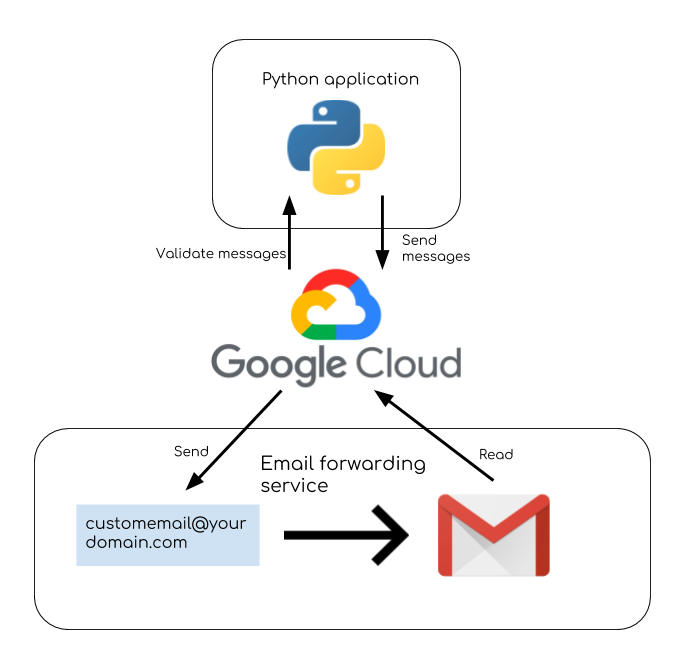
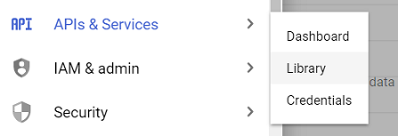
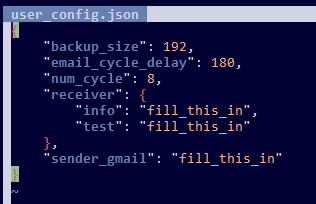

## Email Forwarding Validator

This application will allow you to validate the reliability of your email forwarding service to a Google Gmail account by automating the sending, receiving and validation of emails from a Python application. The Google Cloud Gmail API is used to send emails and read them on the Gmail accounts.

 |
------------ | 
_High level design_ | 

It works by starting two processes: `send` and `receive` that run concurrently:

 |
------------ | 
_`send` and `receive` processes: values in bold are configurable_ |

The `send` process sends **num_cycle** emails at an interval of **email_cycle_delay** seconds. The `receive` process checks after **email_cycle_delay** x **num_cycle** seconds that **num_cycle** emails have been received. There is half a cycle delay added at the beginning of `receive` and at the end of `send` as offset to avoid timing issues with emails in transit.

### In This Guide  

This README is more of a guide and includes instructions on everything from setting up your Google Cloud services, to setting up the Python application and setting up the cron jobs on your server for automation.

It consists of the following parts:

- Using the Google cloud platform to set up 2 services:
  - One that handles the sending of emails at a given interval from the `send account`
  - Another one that handles checking that all the sent emails are received at `receive account`
- Setting up the Python application that implements the logic required to utilize the above services
- Setting up the cronjobs that can be run on a Unix-based server to execute the Python application at a given interval

Note that this guide assumes you are using a Unix cron scheduler but theoretically you could run this from any machine as long as it has a scheduler and can run Python. In this case we would normally call this machine the 'server' but actually the way it's applied here it's more of a client as it will be interacting with Google Cloud.

What you will need:
- A machine with a scheduler that can run Python - ideally with 24/7 availability
- Access to a Gmail account for sending emails - for brevity we will call this the `send account` from now on
- Access to the Gmail account you are testing (and which your email forwarding service forwards your emails to) - again for brevity we will call this the `receive account`

In total there can be 4 email accounts involved:
- The Gmail `receive account`
- The Gmail `send account`
- The email account with your custom domain that has a forwarding service enabled
- The email account which will receive reports/notifications (optional)

### Create Google Cloud Projects

This section shows you how to create your own Google Cloud project. The benefit of doing so is it will allow you to have full control of the service and your data.

To create the two Google Cloud projects, you will just need one Google account. This can be done using one of the two above mentioned Gmail accounts, or even a different Google account.

At the time of writing this, this could be done by visiting Google's cloud platform console: 

https://console.cloud.google.com

#### Create project for receive account

In the Google Cloud console, click on the "Select a project" dropdown:

 |
------------ | 
_Dropdown to create a new project_ |

Then click on "NEW PROJECT"

Name the new project something along the lines of `Validator-Receive` - just mention that this will be used for receiving emails.

Don't worry about specifying an organization.

 |
------------ | 
_Creating the project_ |

Note that it will take a bit of time for your project to be created.

 |
------------ | 
_Waiting for the project to be created_ |

Once created, you can click on the notification, or the page should eventually take you to the project's dashboard.

In the left panel of the dashboard you should be able to click on APIs & Services > Library

 |
------------ | 
_Finding the API library_ |

From here, just search for Gmail API. It should be the first result.

 |
------------ | 
_Searching the API library_ |

 |
------------ | 
_Adding the Gmail API_ |

Click on Enable -> Credentials -> + Create Credential

From here, you'll eventually need to create an OAuth client ID, but the UI allows you to enter information to determine that this is the kind of key you'll need. (Update July 15, 2019: this may have been removed). You can fill in the following information:

 |
------------ | 
_Credentials wizard/questionnaire_ |

Note that although we are specifying "Other UI" the Python application itself does not have a user interface, but it will give us a link that we'll use to authenticate our services which we can run on any browser.

Now create a client ID - again it helps to use a name along the lines of `ReceiveClient`

In the consent screen, it'll help to mention the `receive account` for when you're authenticating. If the credentials setup UI changes, essentially this will be application name on the consent screen. Something like `Receive account: use your-receive-account-email@gmail.com`.

 |
------------ | 
_Setting up the receive account consent screen_ |

Once complete, download the credentials. It will be saved in JSON format. Click Done.

The next thing we need to do is add the appropriate scope, which specifies what the Google service can do. Since this is the receive account, we'll want to be able to read the account's emails. This can be done with the `auth/gmail.modify` scope.

Click on the "OAuth consent screen" tab

 |
------------ | 
_Adding a project scope_ |

Scroll down to "Scopes for Google APIs" and click on "Add scope"

From the list, add the `../auth/gmail.modify` scope.

Note the sensitive scopes warning. For our use, we are the project creator so we don't have to worry about the use of our own data. We should be able to safely ignore any scope warnings.

Don't forget to click "Save" at the bottom!

#### Create project for send account

These steps are the same as for creating the project for the receive account, except for the following:

* Name the project something like `Validator-Send`
* Name the client ID something like `SendClient`
* On the consent screen mention the `send account`

Most importantly, the scope you want to add is `../auth/gmail.send`

 |
------------ | 
_Adding the Gmail `send` scope_|

### Set up Python Application

This section describes how to set up your environment to run the Python application, including pulling the code, installing necessary tools and depencencies, getting your API token and configuring the app. 

#### Clone repository

Make sure you're in the directory where you want to run the Python application and Cronjob from. The rest of these steps will denote the current directory by `<path>`

```
$ git clone https://github.com/snxfz947/email-forwarding-validator.git
```

Alternatively, if you want to use SSH:

```
$ git clone git@github.com:snxfz947/email-forwarding-validator.git
```

The rest of the steps will assume the repository is in a directory named `email-validator` so it is suggested to rename the repository:

```
$ mv email-forwarding-validator email-validator
``` 

#### Install relevant tools

To run the Python application you will need to install Python as well as some dependencies.

##### Python

The steps you take to install Python largely depends on the OS or distribution you're using. Chances are you already have Python installed or it was there by default. **The most important thing is that you have Python 3** (not Python 2). You will also need [pip](https://en.wikipedia.org/wiki/Pip_(package_manager)) for Python 3. Here are the steps for installing from the Python docs:

https://docs.python-guide.org/starting/install3/linux/

If you decided to go with Ubuntu 18.04 server, Python 3 is already installed but pip can be installed using the following:

```
$ sudo apt-get install python3-pip
``` 

Check your Python version using the `-V` argument:

```
$ python3 -V
Python 3.6.5
```

Note that for the particular Ubuntu server version `python3` is used to invoke Python 3, `python` runs Python 2. Similarly for pip, `pip3` is used to invoke the package manager for Python 3.

Check that `pip3` is set up correctly:

```
$ pip3 -V
pip 9.0.1 from /usr/lib/python3/dist-packages (python 3.6)
```

##### jq

Run the following (on Ubuntu at least) to install `jq`:

```
$ sudo apt install jq
```


##### Google API client dependencies

Run the following:

```
$ pip3 install --upgrade google-api-python-client oauth2client
```

#### Add credentials

After the Create Google Cloud Projects section you will have two JSONs with the credentials for your Google projects. Go ahead and copy and paste the contents into `<path>/email-validator/receive/credentials-receive.json` and `<path>/email-validtor/send/credentials-send.json` (replace the existing contents)

#### Configure token

We will now use our credentials to get our API token for sending requests to our projects.

Run the `config` script:

```
$ cd <path>/email-validator
$ ./config
```

Follow the first link shown by entering it in any browser - the consent screen should tell you what account to sign in with. This should be the `send account`

 |
------------ | 
_Authenticating the app in a browser_ |

Copy the code and enter it in your command line window. This will set up your send account API token.

Repeat the steps with the second link to set up your `receive account` API token.

#### Complete configuration JSON

When you open `<path>/email-validator/user_config.json` you will see the following:

 |
------------ | 
_The full `user_config.json` file_|

##### Required fields

The fields populated with `fill_this_in` are required.

* `receiver.info` - this can be any email address at which you'd like to receive automation failure reports - emails will only be sent to this if a run fails
* `receiver.test` - IMPORTANT: this is _not_ the `receive account` - this is the email address you are testing, i.e. the account that has forwarding set up, and routes emails eventually to the `receive account`
* `sender_gmail` - this is the `send account` - the Gmail account that will send the test emails

##### Optional/adjustable fields

The remaining configurable fields are optional.

* `backup_size` - the number of emails that are left in the `receive account` after a run - by increasing this you will have more history to look back at in case there are some emails lost by the forwarding service
    * Default is `192`
* `email_cycle_delay` - the delay in seconds between emails that are sent from the `send account` 
    * Default is `180` - note that it has been observed that higher values may result in the Python application running out of memory and the program getting killed before completing
* `num_cycle` - the number of emails that are sent by the `send account` and looked for in the `receive account`
    * Default is `8`

### Using the App

This section describes how to manually execute the app (the last section explains how to set it up to run automatically) and view the execution logs.

#### Running for the First Time

Before making the first test run, it would be a good idea to change the `verbosity.verbose` setting to `true` (from the previous section)

You can make a manual run by running:

```
$ cd <path>/email-validator
$ ./cronjob &
```

The `&` at the end will allow you to run the app in the background.

#### Viewing Logs

To see the logs, open `<path>/email-validator/output.txt` This can be done by running:

```
$ cat <path>/email-validator/output.txt
```

 |
------------ | 
_Viewing the logs_ |

Here you can see that the cronjob detected that the app was not running, so it started it up. This is indicated by the `CRONJOB:` tag. You can also see that `receive` has started, and `send` has sent it's first message.

#### Clearing Logs

To clear the logs, run:

```
$ cd <path>/email-validator
$ ./clear
```

#### Kill the App

To kill the app, run:

```
$ cd <path>/email-validator
$ ./kill
```

If your cron job has been set up (instructions below) then at the next scheduled run it will restart. 

### Scheduling Runs Using Cron

To open the [crontab](http://man7.org/linux/man-pages/man5/crontab.5.html) run:

```
$ crontab -e
```

This should open the file in your preferred editor. On a fresh Ubuntu instance it will let you choose which editor you want to use - if you're not sure, enter "2". You want to enter the following at the end of the file, replacing `<path>` according to the actual path where you cloned the repository:

```
0 */8 * * * <path>/email-validator/cronjob
```

If you're not sure what's happening at this point, you're in the [vim](https://coderwall.com/p/adv71w/basic-vim-commands-for-getting-started) editor. Just press "j" until your cursor reaches the bottom, "o" to start editing, then copy+paste the above if your shell terminal allows it, otherwise enter it in manually. Then press ESC to exit editor mode, ":" (colon), "wq" then ENTER to save and exit. 

 |
------------ | 
_Editing the crontab_ |

This will run the script at 8AM, 4PM and 12AM daily, as denoted by the `0` in the minutes column, the `*/8` for hours divisible by 8, and asterisks for the remaining columns. See [cronjob](cronjob).


#### Hint for development

To debug the output of the cronjob, you can use the following, which will pipe stdout and stderr to a text file:

```
<minute> <hour> * * * <path>/email-validator/cronjob >> <path>/email-validator/cronLog.txt 2>&1
```
